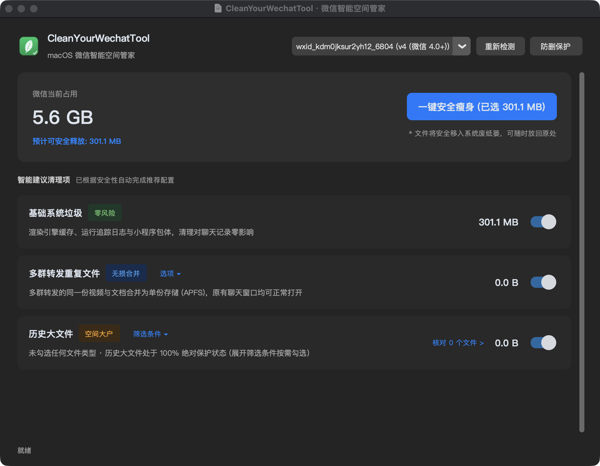

# CleanYourWechatTool

**为长期使用微信的 Mac / Windows 用户释放被重复文件与冗余缓存占满的磁盘空间——不删除聊天记录，文件在微信里照样能打开。**

<p align="center">
  <strong>多群转发的同一份文件只占用一份磁盘 · 文档与聊天记录零损伤 · 清理走系统废纸篓可恢复 · 内置防误删白名单</strong>
</p>

<p align="center">
  <a href="#下载与安装"></a>
  <a href="#下载与安装"></a>
  <a href="#下载与安装"></a>
  <a href="#工作原理与核心机制"></a>
  <a href="#测试与验证"></a>
  <a href="LICENSE"></a>
</p>

---

## 界面预览

<!-- 截图占位：把图片放到 docs/images/ 下，路径已配好，文件就位即自动显示 -->
<p align="center">
  
</p>

<!-- 第二张截图(清理前核对清单)待补充: 把图片放到 docs/images/screenshot-preview.png
     后取消下面注释即可自动显示, 无需改动其他内容。
<p align="center">
  
</p>
-->

---

## 下载与安装

前往 [GitHub Releases](https://github.com/LuckTerence/CleanYourWechatTool/releases) 下载对应安装包：

| 平台 | 安装包 | 说明 |
|---|---|---|
| macOS (Apple Silicon M1–M4) | `CleanYourWechatTool-arm64.dmg` | 打开后把应用拖入「应用程序」 |
| macOS (Intel) | `CleanYourWechatTool-x86_64.dmg` | 同上 |
| Windows 10 / 11 (64 位) | `CleanYourWechatTool-windows-x64.zip` | 解压后双击 `CleanYourWechatTool.exe`，免安装 |

### 首次打开：三步

**1. 放行应用**（本项目为开源软件，未购买 Apple / Microsoft 付费签名证书，系统会拦一次）

<details>
<summary><strong>macOS：提示"无法验证开发者"或"已损坏"</strong></summary>

<p>

**图形界面方式（所有版本适用，推荐）**

1. 双击应用，看到"Apple 无法验证此 App"后点 **完成**；
2. 打开 **系统设置 → 隐私与安全性**，向下滚动到 **安全性** 一栏；
3. 会出现"已阻止使用 CleanYourWechatTool"，点 **仍要打开**，输入密码确认；
4. 再次双击应用，在弹窗中点 **仍要打开**。

**终端方式（最快，一行命令）**

```bash
xattr -cr /Applications/CleanYourWechatTool.app
```

> macOS 14 及更早版本可右键图标 → 打开；**macOS 15 起 Apple 已移除该方式**，请使用上面的两种方法之一。

</p>
</details>

<details>
<summary><strong>Windows：提示"Windows 已保护你的电脑"（SmartScreen）</strong></summary>

<p>

1. 在蓝色警告框点击 **更多信息**（More info）；
2. 点击右下角 **仍要运行**（Run anyway）。

若解压后运行仍被拦截，右键 `CleanYourWechatTool.exe` → **属性** → 勾选底部的 **解除锁定** → 确定。

</p>
</details>

**2. 授予微信数据读取权限**

<details>
<summary><strong>macOS：提示"未找到微信数据"</strong></summary>

<p>

微信的数据目录受系统保护，需手动授权：

**系统设置 → 隐私与安全性 → 完全磁盘访问权限 → 打开 CleanYourWechatTool 的开关**，然后重启应用。

（应用内检测到未授权时也会给出跳转该设置面板的提示。）

</p>
</details>

**3. 扫描 → 勾选 → 一键清理**

打开应用后会自动扫描微信占用；确认推荐的清理项，需要时展开「核对清单」逐条勾选或排除，最后点「一键安全瘦身」。

> 所有被清理的文件都会**移入系统废纸篓 / 回收站**，随时可以「放回原处」还原。

---

## 与其他清理方式的区别

| 评估维度 | 微信内置"存储空间清理" | 常见第三方清理工具 | **CleanYourWechatTool** |
|---|:---:|:---:|:---:|
| **多群重复文件** | 识别不了，按群各存一份 | 直接删除文件 | **APFS 原生硬链接：物理只占一份，各群都能打开** |
| **聊天窗口文件可用性** | 删除后无法打开 | 提示"文件已过期或被清理" | **路径不变，照常预览打开** |
| **清理可恢复性** | 不可逆 | 直接删除 / 混在废纸篓 | **全部走系统废纸篓，可逐一还原** |
| **误删防护** | 无 | 仅按目录大类勾选 | **联系人 / 群聊 / 文件名关键词白名单** |
| **操作门槛** | — | 命令行或需配置环境 | **下载即用，图形界面** |

---

## 核心特性

1. **无损去重**：多群转发的同一份视频/文档，合并为一份物理存储，各聊天窗口照常打开；
2. **缓存清理**：渲染引擎缓存、运行日志、小程序包体等零风险垃圾，一键释放；
3. **历史大文件核对**：按时间与大小筛选陈年大文件，清理前可逐条核对、排除；
4. **防删白名单**：把重要联系人、群聊或关键词（合同、发票、报价单）加入保护，相关文件永不参与清理；
5. **可恢复**：所有清理动作移入系统废纸篓 / 回收站，不执行不可逆删除；
6. **完全本地**：不联网、不上传、无遥测，不解析聊天正文，不注入微信进程。

---

## 常见问题

<details>
<summary><strong>Q: 去重之后，微信里还能正常打开这些文件吗？</strong></summary>
<p>
可以。硬链接是文件系统层面的引用机制：去重后各聊天会话目录下的文件路径与文件名都保持不变，微信读取时透明获取同一份物理数据块，不会出现"文件已失效"。
</p>
</details>

<details>
<summary><strong>Q: 会不会读取我的聊天内容、或者有隐私外泄风险？</strong></summary>
<p>
不会。工具只操作本地文件系统中的多媒体与文档文件，不解析聊天正文数据库，不注入微信进程，代码中没有任何网络请求与遥测逻辑。微信 4.0 的数据库为加密存储，本工具既无能力也无意读取其内容。
</p>
</details>

<details>
<summary><strong>Q: 清理错了怎么恢复？</strong></summary>
<p>
所有清理默认移入系统废纸篓（macOS）/ 回收站（Windows），不做不可逆删除。在废纸篓中找到文件右键「放回原处」即可还原。选择「归档到外置目录」时，归档目录内会生成 <code>archive_manifest.json</code> 记录每个文件的原始路径，可据此批量还原。
</p>
</details>

<details>
<summary><strong>Q: 会导致微信封号或崩溃吗？</strong></summary>
<p>
不会。封号风险通常来自内存注入、客户端逆向或自动化协议通信。本项目是独立的本地文件管理工具，不依附微信进程运行，不修改客户端程序包与签名。
</p>
</details>

<details>
<summary><strong>Q: 支持哪些系统与微信版本？</strong></summary>
<p>
macOS（Apple Silicon 与 Intel）与 Windows 10/11；兼容微信 3.x 与微信 4.0+ 的目录结构，支持多账号自动识别。Windows 版为新增支持，如遇目录结构差异请提 Issue。
</p>
</details>

---

## 背景与问题

微信长期使用后通常占用数十至上百 GB，主要成因与现有方案的局限：

1. **多群转发冗余**：同一份 100MB 视频转发至 8 个群，微信在各群目录分别写入独立文件，产生 800MB 物理占用；
2. **内置清理缺乏细粒度**：微信自带存储管理主要提供按会话删除聊天记录，无法在保留文件索引的前提下释放重复空间；
3. **通用清理工具破坏文件可用性**：第三方工具直接删除文件实体后，聊天窗口中的对应文件显示"已失效或已被清理"。

**CleanYourWechatTool** 通过文件系统特性与本地规则配置，在保留文件可访问性的前提下释放重复占用。

---

## 工作原理与核心机制

### 1. 无损硬链接去重
- 计算文件内容哈希，将内容相同的重复附件合并为指向同一数据块（inode）的硬链接；
- 物理空间仅保留一份，各群聊路径与文件名保持不变，点击仍可正常预览；
- 失败时安全降级（跨卷、文件被占用等场景），绝不删除原文件。

### 2. 白名单保护
- **联系人与群聊防护**：按备注、昵称或 wxid 配置保护规则；
- **关键词匹配**：按文件名关键词（如"合同"、"报价"、"发票"）保护；
- **优先级最高**：清理调度中优先执行白名单过滤，命中即跳过。

> 说明：微信 4.0 的联系人数据库为加密存储，工具无法读取通讯录中的昵称用于自动匹配，白名单按**文件名关键词**与**账号标识**生效。

### 3. 系统废纸篓与外置归档
- **废纸篓保护**：清理默认调用系统原生回收接口（macOS Trash / Windows Recycle Bin），支持"放回原处"；
- **外置归档**：可将超过指定时间与体积阈值的文件迁移至外部介质（移动硬盘 / NAS），保留原目录结构，并生成 `archive_manifest.json` 清单供还原。
- **归档后的行为边界（重要）**：归档文件**不再位于本机**，因此在微信内点击这些文件会提示"文件不可用"——这是预期行为，不是故障。需要查阅时插回该磁盘，执行一条命令即可原样恢复到微信目录：

  ```bash
  cleanyourwechat restore --manifest "/Volumes/你的硬盘/wechat/archive_manifest.json"
  ```

### 4. 数据库保护与无侵入设计
- **数据库物理死线**：硬编码排除 `db_storage`、`Msg` 等数据库目录及 `.db`、`.sqlite`、`.db-wal`、`.ldb` 等敏感后缀，任何清理规则都不可触碰；
- **纯文件层操作**：不解析聊天正文，不修改数据库，不注入内存，不挂钩微信进程。

---

## 命令行用法（进阶）

本项目同时提供命令行接口，适合脚本化或批量处理。

```bash
git clone https://github.com/LuckTerence/CleanYourWechatTool.git
cd CleanYourWechatTool
python3 clean_wechat.py            # 交互式引导
```

### 存储分布分析

```bash
python3 clean_wechat.py scan
```

### 重复文件去重

```bash
python3 clean_wechat.py dedup --dry-run   # 演练：只统计不修改
python3 clean_wechat.py dedup             # 执行：转为硬链接
```

### 白名单规则

```bash
python3 clean_wechat.py tag --add "重要客户" --keywords "合同,报价,发票"
python3 clean_wechat.py tag --list
```

### 归档至外置存储

```bash
python3 clean_wechat.py clean --days 365 --min-size 50MB --archive-to /Volumes/Backup/wechat
```

### 按归档清单还原

```bash
python3 clean_wechat.py restore --manifest /Volumes/Backup/wechat/archive_manifest.json
```

### 安装为系统命令

```bash
pip install .
cleanyourwechat scan
```

---

## 测试与验证

项目包含自动化测试集，覆盖去重、白名单、状态管理、GUI 交互与 CLI 端到端流程：

```bash
python3 -m unittest discover -s projects/wechat-intelligence-hub/tests
```

CI（GitHub Actions）在 **macOS / Windows / Ubuntu × Python 3.8–3.12** 矩阵上运行全套测试、静态检查（flake8 / mypy / bandit）与安全扫描，并在发布前对打包产物执行**启动冒烟测试**——产物无法启动则发布流程直接失败。

---

## 参与贡献

欢迎提交 Issue 反馈问题或 PR 改进代码：

1. 提交 [Issue](https://github.com/LuckTerence/CleanYourWechatTool/issues) 时请附上系统版本、微信版本与操作步骤；
2. 提交 Pull Request 前请确保本地测试通过。

---

## 开源协议

本项目基于 [MIT License](LICENSE) 开源。
